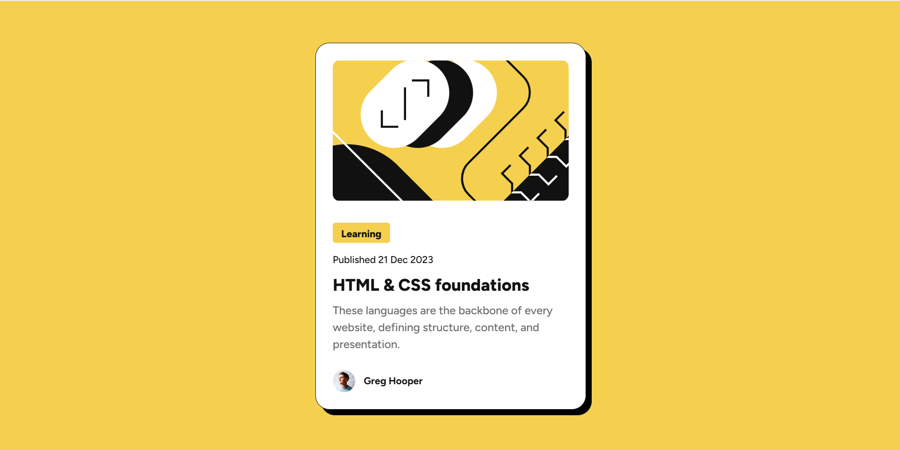
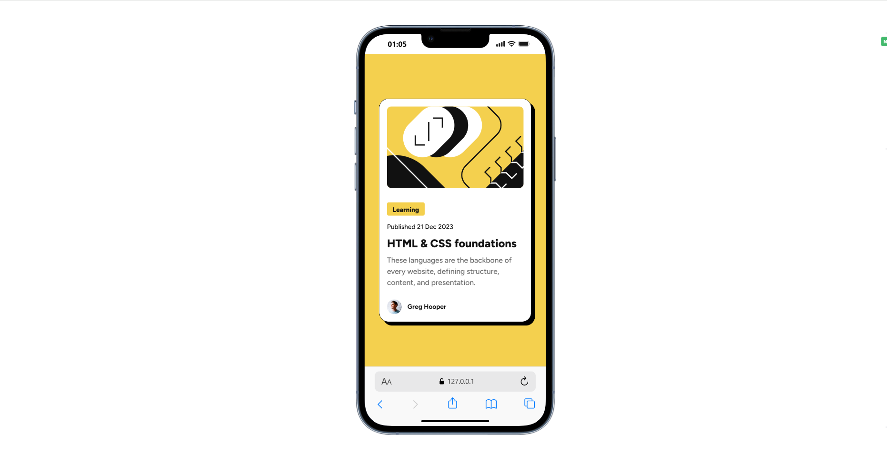
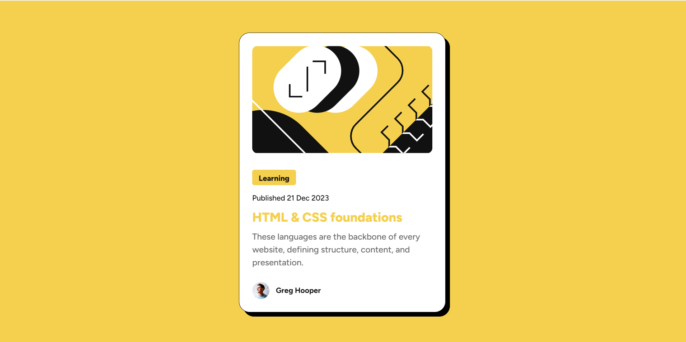

# Frontend Mentor - Blog preview card solution

This is a solution to the [Blog preview card challenge on Frontend Mentor](https://www.frontendmentor.io/challenges/blog-preview-card-ckPaj01IcS). Frontend Mentor challenges help you improve your coding skills by building realistic projects. 

## Table of contents

- [Overview](#overview)
  - [The challenge](#the-challenge)
  - [Screenshot](#screenshot)
  - [Links](#links)
- [My process](#my-process)
  - [Built with](#built-with)
  - [What I learned](#what-i-learned)
  - [Continued development](#continued-development)
  - [Useful resources](#useful-resources)
- [Author](#author)

## Overview

### The challenge

Users should be able to:

- See hover and focus states for all interactive elements on the page

### Screenshot







*Screenshot of the completed blog preview card showing the modern design with hover effects*

### Links

- Solution URL: [Solution URL](https://github.com/ichane31/blog-card)
- Live Site URL: [Live Demo](https://blog-card-three-beta.vercel.app/)

## My process

### Built with

- Semantic HTML5 markup
- CSS custom properties (CSS variables)
- CSS Flexbox for layout
- Mobile-first workflow
- Figtree variable font
- Modern CSS features (box-shadow, border-radius)
- Responsive design principles

### What I learned

This project helped me strengthen my understanding of several key web development concepts:

**CSS Custom Properties**: I implemented a clean design system using CSS variables for colors and typography:

```css
:root {
    --yellow-color: hsl(47, 88%, 63%);
    --white-color: hsl(0, 0%, 100%);
    --gray-500: hsl(0, 0%, 42%);
    --gray-950: hsl(0, 0%, 7%);
}
```

**Variable Fonts**: Successfully implemented the Figtree variable font with multiple weight utilities:

```css
@font-face {
    font-family: "Figtree";
    src: url("./assets/fonts/Figtree-VariableFont_wght.ttf") format("truetype");
    font-weight: 500 800;
}
```

**Semantic HTML Structure**: Created a meaningful card structure that's accessible and SEO-friendly:

```html
<main>
    <section class="card">
        <div class="card__image">
            
        </div>
        <div class="card__content">
            <div class="badge font-extra-bold">Learning</div>
            <time datetime="2023-12-21" class="published font-medium">Published 21 Dec 2023</time>
            <h1 class="card__title font-extra-bold">HTML & CSS foundations</h1>
            <p class="card__text font-medium">These languages are the backbone of every website, defining structure, content, and presentation.</p>
        </div>
    </section>
</main>
```

### Continued development

Areas I want to continue focusing on in future projects:

- **Advanced CSS Animations**: Adding smooth micro-interactions to enhance user experience
- **CSS Grid Mastery**: Exploring more complex grid layouts for future card-based designs
- **Accessibility Improvements**: Implementing better keyboard navigation and screen reader support
- **Performance Optimization**: Optimizing font loading and image delivery
- **Modern CSS Features**: Exploring CSS Container Queries and new layout methods

### Useful resources

- [MDN Web Docs - CSS Custom Properties](https://developer.mozilla.org/en-US/docs/Web/CSS/Using_CSS_custom_properties) - Essential for understanding CSS variables and creating maintainable stylesheets
- [Web.dev - Variable Fonts Guide](https://web.dev/variable-fonts/) - Comprehensive guide that helped me implement the Figtree variable font correctly
- [CSS-Tricks - Complete Guide to Flexbox](https://css-tricks.com/snippets/css/a-guide-to-flexbox/) - Always helpful for perfecting flexbox layouts

## Author

- ASSOUMA Roukéya
- Frontend Mentor - [@ichane31](https://www.frontendmentor.io/profile/ichane31)